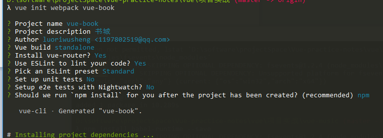

## vue-book 书城

### 开始

>   由于最新的vue-cli拉取的模版和2.X不太一样，我们这个是基于2.X的项目结构开发，所以默认的拉取会是3.X的模板框架
>   想要继续使用2.X的模版，需要安装一个中间桥接插件   
>   关于vue-cli中3.X的创建项目的方式，参见官网，反正2.X与3.X除了模版有差异，使用cli的方式是一样的

```js
    npm install -g @vue/cli-init
    // `vue init` 的运行效果将会跟 `vue-cli@2.x` 相同
    vue init webpack vue-book
```

```js
    vue init webpack vue-book
```

截图效果



阅读拉取的模版代码

**package.json**
npm run dev 做的事情是

```js
"dev": "webpack-dev-server --inline --progress --config build/webpack.dev.conf.js",
```
- 启动一个webpack-dev-server服务，但是我们的webpack是全局安装的，所以这里的使用的配置文件是 build/webpack.dev/conf.js

webpack.dev.conf.js文件中

- 合并了baseWebpackConfig中的配置
- 导入其他一些的配置

webpack.base.conf.js文件中

- 指定webpack打包器的入口，出口
- 指定别名，扩展文件名
- 指定解析规则，各种loader 如：css-loader,url-loader

在webstorm中，如果你使用了webpack配置的别名，并且省略.vue等文件后缀，是没有办法通过按住ctrl+点击文件名，快速跳转到指定文件的（看自己的使用习惯）

---
安装一下的插件

```js
    npm install bootstrap less less-loader axios vuex --save-dev
```

组织项目的目录结构

- api  统一放前端的请求接口
- mock 通过放后台的模拟数据
- base 基础组件
- components 页面级组件

引入阿里字体图标库，在index.html中，直接引入link

### 完成header，footer部分的功能

- 技术实现点：

>   顶部的返回按钮功能，绑定一个点击事件，然后调用 this.$router.go(-1) 实现返回    
>   顶部是否显示返回按钮，通过组件传参的形式，props 去决定是否显示 返回的icon

### 轮播组件的使用 [Vue-Awesome-Swiper](https://github.com/surmon-china/vue-awesome-swiper)

- 安装

```js
    npm install vue-awesome-swiper --save
```

- 使用

>   在main.js中导如组件，并注册

```js
    import VueAwesomeSwiper  from 'vue-awesome-swiper'
    import 'swiper/dist/css/swiper.css'

    Vue.use(VueAwesomeSwiper)

```
使用注意事项：

```js
  export default {
    // 这里的name使用这个
    name: 'carousel',
    data () {
        return {
            swiperOption: {
                pagination: {
                    el: '.swiper-pagination'
                }
            },
            swiperSildes: [1, 2, 3, 4, 5]
        }
    }
}

```
使用vue-swiper注意，想要左右切换按钮，必须通过slot的方式添加，不然，会导致只在第一个页面会有左右按钮,特别要注意slot的名称，可以查看github上的demo对应修改 [demo-github](https://surmon-china.github.io/vue-awesome-swiper/)

```js
 <div class="swiper-button-prev" slot="button-prev"></div>
<div class="swiper-button-next" slot="button-next"></div>
<div class="swiper-pagination" slot="pagination"></div>
```


### 轮播图模拟数据

- 写后台接口
- 解决node跨域问题，前端地址是 localhost:8080 请求的后台地址是localhost: 3001 存在跨域问题

>   百度搜索node跨域头，粘贴过来 [Node.js express 跨域问题](https://cnodejs.org/topic/51dccb43d44cbfa3042752c8)

```js
res.setHeader("Access-Control-Allow-Origin", "*");
res.setHeader("Access-Control-Allow-Headers", "Content-Type,Content-Length, Authorization, Accept,X-Requested-With");
res.setHeader("Access-Control-Allow-Methods","PUT,POST,GET,DELETE,OPTIONS");
res.setHeader("X-Powered-By",' 3.2.1')
if(req.method=="OPTIONS") return res.end();/*让options请求快速返回*/
```
>   上面是原生node写的，如果是express，那么设置返回头的名称可能有点差异

## 热门图书的功能

- 先写服务端，确保数据能够正常返回
- 增加api方法实现调取数据的功能
- 在哪个组件中应用API，如果是一个基础组件，需要用这些数据，在使用这些组件的父级中使用，通过props传参给基础组件；不需要复用的组件，写在当前定义组件的地方
- 写基础组件
    + 1.创建一个.vue文件
    + 2.在需要使用这个组件的父级中引用这个组件
    + 3.在组件中注册
    + 4.以标签的形式引入（使用）

## 路由元信息

- 做页面级缓存

## 下拉加载

- 默认每次给5条，前台告诉后台，从那一条开始吐数据
- /page?offset=5 , 后台还需要告诉前端，是否有更多数据 hasMore: true/false

## 图片懒加载

- 安装  [vue-lazyload](https://github.com/hilongjw/vue-lazyload)

## coding split 代码分割

## vuex

以前
- 平级组件的通讯，找共同的父级组件
- 跨组件交互通讯，使用eventBus（缺点： 混乱，难以管理，实质是发布订阅模式）

vuex主要借鉴了flux,redux, vuex只能在vue中使用

vuex为了大型项目而产生，主要做状态管理，状态即数据，vuex将数据统一管理


